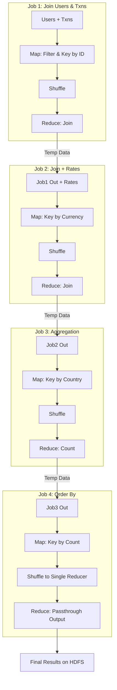

# Apache Hive Deep Dive: Architecture, Execution, and Internals

This guide details the internal mechanisms of Apache Hive, focusing on how HQL queries are translated into MapReduce jobs, with a specific 4-stage execution example, algorithm deep dives, and component architecture.

---

## 1. Hive Architecture Components

Hive translates SQL-like queries into low-level execution plans (MapReduce, Tez, or Spark).

```mermaid
graph TD
    User[User/Client] -->|Submit Query| Driver
    Driver -->|Get Metadata| MS[Metastore]
    MS -->|Schema/Partitions| Driver
    Driver -->|Plan Query| Compiler
    Compiler -->|Optimize Plan| Driver
    Driver -->|Execute DAG| EE[Execution Engine]
    EE -->|MapReduce Jobs| RM[Resource Manager (YARN)]
    RM -->|Tasks| DN[DataNodes (HDFS)]
    
    subgraph "Hive Architecture"
    Driver
    Compiler
    MS
    EE
    end
```

### Key Components Detailed Breakdown

#### 1. Drivers: The Control Center
The **Driver** is the entry point for all Hive queries. It acts as the controller that manages the entire lifecycle of a HiveQL statement.
*   **Session Management**: When a client connects (via CLI, JDBC, or ODBC), the Driver creates a session handle and manages session-specific statistics.
*   **Orchestration**: It receives the query string, passes it to the Compiler, gets the execution plan, and submits it to the Execution Engine.
*   **Result Fetching**: Once the execution is complete, the Driver fetches the results from the temporary output files (or directly from the engine) and formats them for the client.

#### 2. Compiler: The Planner
The **Compiler** is responsible for translating the string-based HiveQL into an executable plan. This involves several distinct phases:
*   **Parsing**: Using ANTLR, it converts the SQL string into an Abstract Syntax Tree (AST).
*   **Semantic Analysis**: It traverses the AST and consults the **Metastore** to verify that tables, columns, and partition keys exist and that data types are compatible.
*   **Logical Plan Generation**: It builds a recursive operator tree (e.g., `TableScan` -> `Filter` -> `Select`).
*   **Optimization**: The Logical Optimizer (including the Cost-Based Optimizer, CBO) applies rules like:
    *   *Predicate Pushdown*: Moving filters as close to the data source as possible.
    *   *Partition Pruning*: Identifying which HDFS folders can be ignored.
    *   *Map Join Detection*: Checking if a small table fits in memory to avoid a Shuffle Join.
*   **Physical Plan Generation**: Finally, it breaks the optimized operator tree into stages of MapReduce tasks and serializes them into an execution plan.

#### 3. Metastore: The Catalog
The **Metastore** is the central repository for metadata. It separates "Data" (in HDFS) from "Structure" (the schema).
*   **Backing Store**: Unlike the rest of Hadoop, the Metastore requires a low-latency RDBMS (like PostgreSQL, MySQL, or Derby) to store table definitions, column types, and location pointers.
*   **Service Interface**: It exposes a Thrift interface (HMS) that allows the Compiler and other tools (like Spark or Presto) to query metadata without touching the raw database.
*   **Data vs. Metadata**: It knows *where* the data is (`hdfs://.../user/hive/warehouse/table_name`) but never touches the actual files. Unique to Hive is the ability to drop a table definition in the Metastore while deciding whether to keep the actual data (External Table) or delete it (Managed Table).

#### 4. Execution Engine: The Worker
The **Execution Engine** takes the plan from the Compiler and executes it.
*   **MapReduce (MR)**: In your setup (Hive 2.3.2), this is the default. The engine serializes the plan into a `plan.xml` and submits it to the Hadoop **Resource Manager (YARN)**.
    *   YARN allocates containers on **DataNodes**.
    *   If it's a Map-only job (e.g., `SELECT *`), it runs quickly.
    *   If it requires aggregation (e.g., `GROUP BY`), it triggers the full Map-Shuffle-Reduce cycle.
*   **Tez/Spark**: In modern Hive, these engines replace MR. they use Directed Acyclic Graphs (DAGs) to run the entire query as a single job, avoiding the "write-to-disk" penalty of intermediate MapReduce steps.

---

## 2. Deep Dive: Query Execution (The "4 Jobs" Example)

To illustrate a complex workflow, let's analyze a query that typically triggers **4 MapReduce Jobs**. This usually involves multiple joins followed by aggregation and global sorting.

### The Scenario Query

```sql
SELECT 
    u.country, 
    COUNT(t.amount) as high_value_txns
FROM users u
JOIN transactions t ON u.id = t.user_id
JOIN currency_rates c ON t.currency = c.currency
WHERE t.amount > 1000
GROUP BY u.country
ORDER BY high_value_txns DESC;
```

### Execution Breakdown

This query is processed in stages. In a standard MapReduce execution engine (without advanced optimizations like Map-Side Joins enabled), this would break down as follows:

#### **Job 1: The First Join (Users + Transactions)**
*   **Goal**: Join `users` and `transactions` where `amount > 1000`.
*   **Map Phase**:
    *   Mapper A (Users): Reads `users`, emits key=`id`, value=`{users, country}`.
    *   Mapper B (Transactions): Reads `transactions`, filters `amount > 1000`, emits key=`user_id`, value=`{transactions, currency, amount}`.
*   **Shuffle & Sort**: Keys (user IDs) are grouped.
*   **Reduce Phase**: Receives `{users, ...}` and `{transactions, ...}` for the same ID. Performs the join product. Emits updated rows.
*   **Output**: Temporary File 1 (Interim results).

#### **Job 2: The Second Join (+ Currency Rates)**
*   **Goal**: Join the result of Job 1 with `currency_rates`.
*   **Map Phase**:
    *   Mapper C (Temp File 1): Reads output of Job 1. Emits key=`currency`, value=`{Job1_Row}`.
    *   Mapper D (Currency Rates): Reads `currency_rates`. Emits key=`currency`, value=`{currency_rates, rate}`.
*   **Shuffle & Sort**: Grouped by `currency`.
*   **Reduce Phase**: Joins the rows.
*   **Output**: Temporary File 2.

#### **Job 3: Aggregation (Group By)**
*   **Goal**: `GROUP BY u.country` and `COUNT`.
*   **Map Phase**:
    *   Mapper E: Reads Temp File 2. Extracts `country`. Emits key=`country`, value=`1` (for counting).
*   **Shuffle & Sort**: All `1`s for a specific country are brought to the same Reducer.
*   **Reduce Phase**: Sums the `1`s for each country key.
*   **Output**: Temporary File 3 (`country`, `count`).

#### **Job 4: Global Sorting (Order By)**
*   **Goal**: `ORDER BY count DESC`.
*   **Map Phase**:
    *   Mapper F: Reads Temp File 3. Emits key=`count`, value=`country`.
*   **Shuffle & Sort**: **CRITICAL STEP**. To ensure global order, data must flow to a **single reducer** (or use TotalOrderPartitioner). Hadoop sorts keys entering the reducer.
*   **Reduce Phase**: Emits the sorted stream to final HDFS output.
*   **Output**: Final Result.

### Visualization of the 4 Jobs



---

## 3. Algorithms in Detail

### 3.1 Common Join (Reduce-Side Join)
*   **How it works**: Used when both tables are large.
*   **Map Step**: Tag each row with its table name. Output the join key as the Mapper Key.
*   **Shuffle**: Brings all rows with the same Key (from both tables) to the same Reducer.
*   **Reduce Step**: Load the smaller set of values (for that key) into memory buffer, stream the larger set through, and generate cross-products.
*   **Sample Data**:
    *   T1: `(1, "Alice")` -> Mapper -> `Key:1, Value:{T1, "Alice"}`
    *   T2: `(1, "HR")`    -> Mapper -> `Key:1, Value:{T2, "HR"}`
    *   Reducer receives Key:1, List:[{T1,"Alice"}, {T2,"HR"}]. It loops and joins them.

### 3.2 Map-Side Join (Broadcast Join)
*   **How it works**: Used when one table is small enough to fit in memory.
*   **Process**: Hive reads the small table completely into a Hashtable in memory. It serializes this hashtable and sends it to **all** Mappers processing the large table.
*   **Significance**: **Skips the Shuffle and Reduce phases entirely**. This is a huge performance boost (`hive.auto.convert.join=true`).
*   **Visualization**:
    ```mermaid
    graph LR
        SmallTable -->|Load to Memory| DistributedCache
        DistributedCache -->|Broadcast| Mapper1
        DistributedCache -->|Broadcast| Mapper2
        LargeTable_Chunk1 --> Mapper1
        LargeTable_Chunk2 --> Mapper2
        Mapper1 -->|Join in Memory| Output
        Mapper2 -->|Join in Memory| Output
    ```

### 3.3 Group By (Hash Aggregation)
*   **Hash Aggregation**: Mappers maintain a hash table of keys (e.g., `country`).
    *   For every row, it updates the hash table (e.g., `count++`).
    *   When the map task finishes (or memory fills), it flushes these partial counts to the Reducers. This is "Partial Aggregation" or "Map-Side Combiner".
*   **Benefit**: drastically reduces network traffic. Instead of sending 1 million rows of `("USA", 1)`, the Mapper sends one row `("USA", 1000000)`.

---

## 4. Hive Internals: Tables, Metadata, & Storage

### 4.1 Metadata (The Brain)
Hive does not store data in the Metastore; it stores **definitions**.
*   **Table Name**
*   **owner**
*   **location** (e.g., `hdfs://.../user/hive/warehouse/table`)
*   **SerDe** (Serializer/Deserializer): How to read the raw bytes (CSV, JSON, ORC, Parquet).

### 4.2 Data Storage (The Body)
Hive data is just files in HDFS directories.
*   **Managed Tables**: Hive owns the data. Dropping the table deletes the data files in HDFS.
*   **External Tables**: Hive only owns the schema. Dropping the table leaves HDFS files untouched.

### 4.3 Partitions & Buckets

*   **Partitions**: Folders.
    *   `.../sales/date=2024-01-01/`
    *   `.../sales/date=2024-01-02/`
    *   Querying `WHERE date='2024-01-01'` tells the driver to read **only that folder**, skipping terabytes of other data.
*   **Buckets**: Files within folders.
    *   Hashed based on a column (e.g., `user_id`).
    *   Ensures that specifically `user_id % 4 == 0` goes to File 0.
    *   Crucial for **SMB Join (Sort-Merge-Bucket Join)**, the fastest join algorithm in Hive, as matching keys are guaranteed to be in corresponding files across tables.
